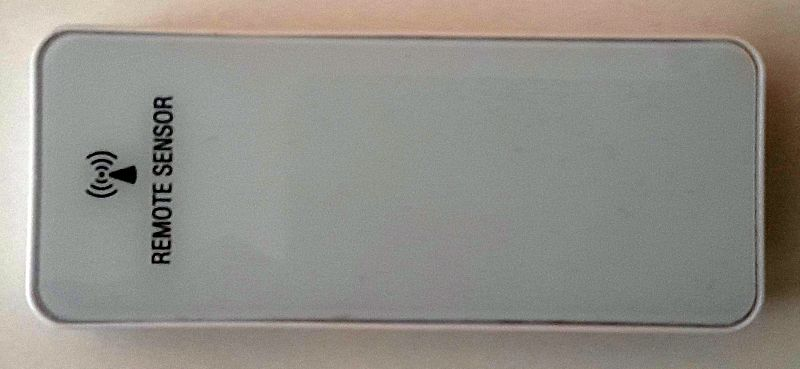
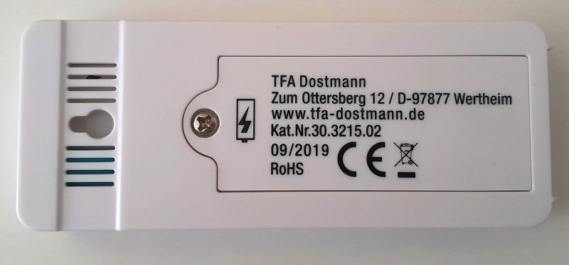
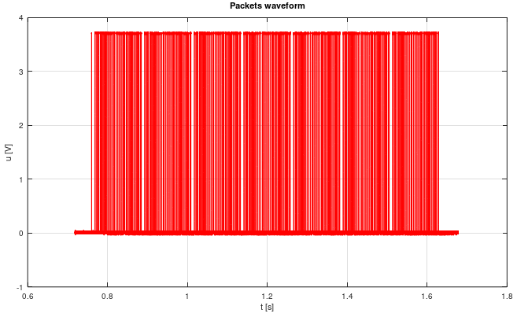
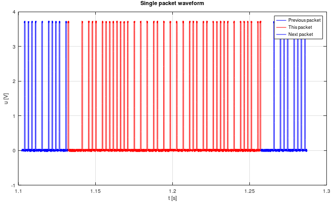

# Decoder of meteo sensor TFA Dostmann 30.3215.02
Git contain set of GNU Octave scripts for decoding remote 433MHz ratio meteo sensors TFA Dostmann type 30.3215.02. It was nowhere to be found on the net, so I tried to decode these by myself. 




Test waveforms for reverse engineering were captured by cheap oscilloscope OWON 7102V and exported as BIN files. The files are read by the script 'tfa.m' and SW decoding of waveform is applied. The source of data can be of course replaced by another loader. Receiver was cheap Aurel AC-RX2/CS for ASK modulation.    

## Data format of TFA Dostmann 30.3215.02 
Every transmission of sensor consist of 7 repetitions of the same packet. Data encoding is PPM (pulse position modulation) driven by gap (low) lengths. Start bit is long gap (~8ms), stop bit is short gap (~0.5ms). High bit is long gap (~3.6ms), low bit is short gap (~1.8ms). Pulse width is approx 0.5ms, but it may vary with receiver and signal strength!There is no CRC. It can be replaced by comparing the 7 repetitions and selecting statistically most common data.




Reverse engineered sensor packet (36 bits, bits(36:1)):
```
 > bits(8:1)   = sensor type ID?   
 > bits(9)     = battery ok flag (1=good, 0=low)
 > bits(14:10) = random ID (generated when battery replaced)?
 > bits(16:15) = channel ID as set on switch (0=chn1, 1=chn2, ...)
 > bits(28:17) = 2's complement temperature [10*deg C] (237=23.7degC)
 > bits(36:29) = relative humidity [%]
```

## License
Project is distributed under [MIT license](./LICENSE.txt).
