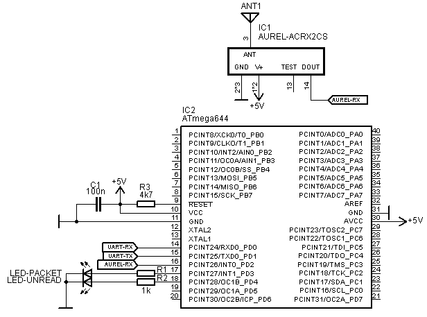
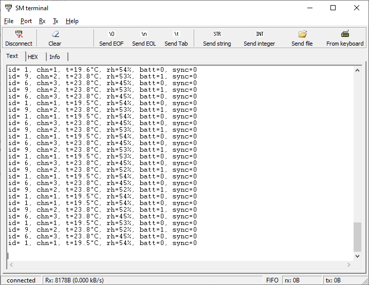

# Decoder of meteo sensor TFA Dostmann 30.3215.02
Git contain set of GNU Octave scripts for decoding remote 433MHz ratio meteo sensors TFA Dostmann type 30.3215.02. It was nowhere to be found on the net, so I tried to decode these by myself. 


Test waveforms for reverse engineering were captured by cheap oscilloscope OWON 7102V and exported as BIN files. The files are read by the script 'tfa.m' and SW decoding of waveform is applied. The source of data can be of course replaced by another loader. Receiver was cheap Aurel AC-RX2/CS for ASK modulation.    

## Data format of TFA Dostmann 30.3215.02 
Every transmission of sensor consist of 7 repetitions of the same packet. Data encoding is PPM (pulse position modulation) driven by gap (low) lengths. Start bit is long gap (~8ms), stop bit is short gap (~0.5ms). High bit is long gap (~3.6ms), low bit is short gap (~1.8ms). Pulse width is approx 0.5ms, but it may vary with receiver and signal strength!There is no CRC. It can be replaced by comparing the 7 repetitions and selecting statistically most common data.


Reverse engineered sensor packet, 36 bits, bits(36:1):
```
 bits(8:1)   = sensor type ID (0x90)?   
 bits(12:9)  = random ID (generated when battery replaced)?
 bits(13)    = battery low flag (1=low, 0=good)
 bits(14)    = sync button pressed (1=sync report, 0=self reporting)
 bits(16:15) = channel ID as set on switch (0=chn1, 1=chn2, ...)
 bits(28:17) = 2's complement temperature [10*deg C] (237=23.7degC)
 bits(36:29) = relative humidity [%]
```

## Example 8-bit AVR receiver
Octave script was meant just for debug purposes. After understanging the format I decided to make a simple receiver using small microcontroller. Table sediments revealed breadboard with working ATmega644, so based the decoder on this 8-bit AVR but it will run on any AVR capable to run at some 8 MHz. It decodes the packets and results can be read via UART using SCPI style commands or eventually it can report all packets by itself (talk mode). More details can be found in the source code.



### SCPI command control:
UART setup: 19200bd, 8bit, no parity, no flow control, 1stop
SCPI style commands are terminated by LF (0x0A), can be chained by semicolon, maximum command chain length is 127 bytes. Answers are LF terminated. Supported commands are following:
```
  *IDN? - return identification string
  *RST - reboot
  SYST:ERR? - return last error if any
  TFA:TALK <0|1> - disable/enable auto reporting of received sensor data
  TFA:HEAD <0|1> - return data with text headers?
  TFA:DATA? - return last sensor data for any channel
  TFA:DATA:NEW? - check if there are new unread sensor data for any chn.
  TFA:SYNC - start synchronization for all sensor channels
  TFA:DATA? <1|2|3> - return last sensor data for given channel 1-3
  TFA:DATA:NEW? <1|2|3> - check if there are new unread channel data
  TFA:SYNC <1|2|3> - start synchronization for selected channel
  TFA:COUNT? - get received sensor data count
  TFA:COUNT:RESET - reset received sensor data count
```

Reported data has following format:
```
  "id= 9, chn=2, t=23.7"C, rh=45%, batt=1, sync=0\n" with headers
  "9, 2, 23.7, 45, 1, 0\n" without headers

  id   - random sensor 4-bit ID
  chn  - channel setup as on switch in sensor (1-3)
  t    - temperature in [degC]
  rh   - relative humidity [%]
  batt - 1 of low battery
  sync - 1 if sync button on sensor pressed, 0 for normal reporting
```

Example of received data with headers are shown in terminal window below.




## License
Project is distributed under [MIT license](./LICENSE).
